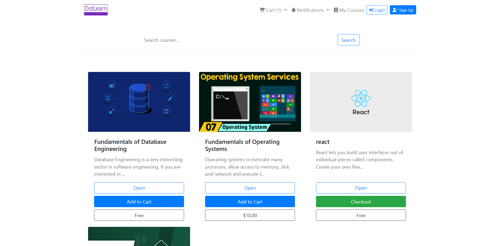
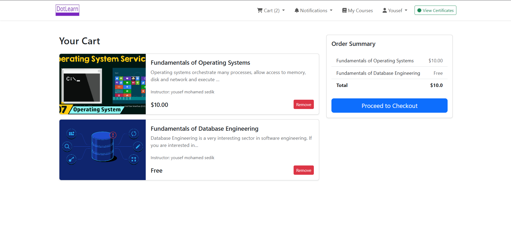

# Dot Course

Dot Course is an E-Learning platform.

## Features

- You easily search for a course using it's name, content, description, instructor name.
- You can rate course, get certificates upon passing all course exams, solve MCQs after watching video content.
- Customized Admin Panel for instructors.


## Tech

"Dot Course" uses a number of open source projects to work properly:

- [Bootstrap5] - HTML enhanced for web apps!
- [VS-Code] - main text editor
- [HTMX] - for sending AJAX requests
- [Django] - for backend sever side 
- [SQLITE3] as the main db 

And of course Dot Course" itself is open source with a [public repository](https://github.com/YousefSedik/Dot-Course/) on GitHub.

Home page


Home page


Home page


Home page


Home page


Home page

## Installation

Dot Course requires [Python](https://www.python.org/downloads/) v3+ to run.

Create A Virtual Enviroment (Optional)
```sh
pip install venv 
python -m venv venv
```
Activate The Virtual Enviromnent 
```sh
\venv\Scripts\activate.bat
```
Create The .env file in the root dir
```
touch .env 
```
Setup this variables in the .env file 
```
SECRET_KEY=''
DEBUG=''
EMAIL_HOST_USER=''
EMAIL_HOST_PASSWORD=''
EMAIL_HOST=""
EMAIL_PORT=   
EMAIL_USE_TLS=''
```

Install the dependencies and devDependencies
```sh
pip install -r requirements.txt
py manage.py migrate 
```
Then You Can Run The Development Directly Using
```sh
py manage.py runserver  
```

